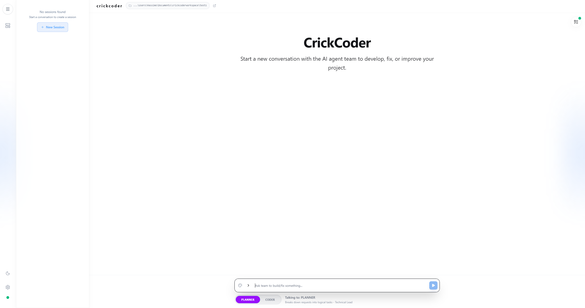

# Crick Coder - AI-Powered Code Assistant Platform

<div align="center">


[](https://github.com/agno-agi/agno)

**Intelligent AI agents that understand your codebase and help you build better software**

</div>

## Overview

Crick Coder (Code Retrieval & Intelligence Check Kernel) is a sophisticated AI-powered development platform that combines **architectural analysis** with **code generation** capabilities. It features specialized AI agents that work together to understand your existing codebase, analyze patterns, and implement changes with context-aware precision.

Unlike generic AI coding assistants, Crick provides **real-time codebase awareness** through automatic file indexing and monitoring, allowing agents to make informed decisions based on your actual project structure and dependencies.

## Key Features

### **Dual-Agent System**
- **Planner Agent**: Analyzes codebases using vector RAG (Retrieval-Augmented Generation) to understand existing patterns, dependencies, and architecture
- **Coder Agent**: Implements code changes with intelligent file operations and shell command execution

### **Real-time Codebase Awareness**
- Automatic file watching and indexing with **LanceDB vector storage**
- Continuous codebase monitoring with **Watchdog integration**
- Smart change detection and synchronization
- Cross-platform support with OS-aware shell commands

### **Developer Experience**
- Modern React UI with real-time streaming responses
- Persistent session management with conversation history
- Multi-project support with independent contexts
- Health monitoring and status indicators
- Dark/light theme support

### **Custom Templates**
- **Personal Library**: Upload and manage your own HTML, CSS, and JavaScript themes
- **Reusability**: Save custom templates to easily reuse your preferred styles across different projects

### **Integrated Project Management**
- **Task Manager**: Organize your development workflow with a built-in task tracking system
- **Kanban Board**: Visualize active tasks and current progress in real-time

### **Screenshot**



### **Extensible Architecture**
- Support for DeepSeek (currently the only fully tested provider)
- Modular agent system with clear separation of concerns

## Architecture

```
┌─────────────────────────────────────────────────────────────┐
│                    React Frontend (crick-ui)                │
│  ┌──────────────────────────────────────────────────────┐  │
│  │  • Real-time chat interface with streaming           │  │
│  │  • Session management & project selection            │  │
│  │  • Health monitoring & status indicators             │  │
│  └──────────────────────────────────────────────────────┘  │
└─────────────────────────────────────────────────────────────┘
                              │
                              │ HTTP/SSE
                              ▼
┌─────────────────────────────────────────────────────────────┐
│                FastAPI Backend (Python)                     │
│  ┌─────────────┐  ┌─────────────┐  ┌───────────────────┐  │
│  │   Manager   │  │  Streamer   │  │     Monitor       │  │
│  │   (Router)  │◄─┤  (Events)   │  │ (File Watching)   │  │
│  └─────────────┘  └─────────────┘  └───────────────────┘  │
│         │                         │                       │
│         ▼                         ▼                       │
│  ┌─────────────┐  ┌───────────────────┐  ┌─────────────┐  │
│  │   Agents    │  │  Vector Indexer   │  │   Storage   │  │
│  │ • Planner   │  │   (LanceDB)       │  │  (Sessions) │  │
│  │ • Coder     │  └───────────────────┘  └─────────────┘  │
│  └─────────────┘                                           │
└─────────────────────────────────────────────────────────────┘
```

### Core Components

1. **Frontend (crick-ui)**: Modern React application with TypeScript, Tailwind CSS, and real-time event streaming
2. **Backend Server**: FastAPI with async support, SSE streaming, and RESTful endpoints
3. **Agent System**: Specialized AI agents built with the Agno framework
4. **Vector Database**: LanceDB for efficient code indexing and semantic search
5. **File Watcher**: Real-time filesystem monitoring with change detection
6. **Session Storage**: Persistent conversation history and agent memory

## Quick Start

### Prerequisites

- **Python 3.10+** with pip
- **Node.js 18+** with npm
- **Git** for version control
- **LLM API Key** (Anthropic, OpenAI, or DeepSeek)

### Installation

1. **Clone the repository**
   ```bash
   git clone https://github.com/massimolauri/CrickCoder.git
   cd CrickCoder

2. **Set up Python Virtual Environment** It is recommended to use a virtual environment to manage dependencies and avoid conflicts.
   ```bash
     Windows

     # Create virtual environment
     python -m venv .venv

     # Activate environment
     .\.venv\Scripts\activate

     macOS / Linux

     # Create virtual environment
     python3 -m venv .venv

     # Activate environment
     source .venv/bin/activate
3. **Set up Python backend**
   ```bash
   
   # 1. Upgrade pip (Required for proper dependency resolution)
   python -m pip install --upgrade pip
   
   # Install Python dependencies
   pip install -r requirements.txt

   ```

4. **Set up React frontend**
   ```bash
   cd crick-ui
   npm install
   cd ..
   ```


### Running the Application

1. **Start the backend server** (in one terminal)
   ```bash
   # From project root
   python server.py
   ```
   Server will start at `http://localhost:8000`

2. **Start the frontend** (in another terminal)
   ```bash
   # From crick-ui directory
   cd crick-ui
   npm run dev
   ```
   Frontend will start at `http://localhost:5173`

3. **Open your browser** and navigate to `http://localhost:5173`

## Packaging (Standalone Executable)

To build the application as a standalone desktop app (Windows .exe):

1. **Clean & Build Python Server**
   This script creates a clean virtual environment, installs dependencies, and runs PyInstaller.
   ```bash
   # From project root
   python build_server_clean.py
   ```
   *Output: `server-dist/server/server.exe`*

2. **Build Electron App**
   Package the Electron frontend and bundle the Python server.
   ```bash
   cd crick-ui
   npm run electron:build
   ```
   *Output: `crick-ui/dist/CrickCoder Setup <version>.exe`*

3. **Install/Run**
   Distribute the generated `.exe` installer. The application uses `~/.crickcoder` for persistent user data.

## Configuration

### LLM Provider Settings
Configure your preferred LLM provider through the UI Settings panel:

- **Provider**: DeepSeek (Currently the only fully tested provider)
- **Model ID**: `deepseek-chat`
- **API Key**: Your DeepSeek API key (stored locally in browser)

### Project Configuration
- **Project Root Path**: Set the absolute path to your codebase
- **Session Management**: Create, switch, or delete conversation sessions

## Usage Guide

### 1. Project Setup
1. Open the web interface at `http://localhost:5173`
2. Click **Settings** (gear icon in sidebar)
3. Enter your **Project Root Path** (absolute path to your codebase)
4. Configure your **LLM Provider** and API key
5. Save settings

### 2. Starting a Session
1. Click **New Session** in the sidebar
2. Choose your agent:
   - **Planner**: For code analysis, architecture review, and planning
   - **Coder**: For code implementation, file operations, and shell commands
3. Begin chatting with your selected agent

### 3. Agent Capabilities

#### Planner Agent
- Analyze codebase structure and dependencies
- Identify architectural patterns and anti-patterns
- Suggest refactoring opportunities
- Create technical plans and documentation
- **Does not write or modify code**

#### Coder Agent
- Read, write, and search files
- Execute shell commands
- Implement code changes based on specifications
- Run tests and build processes
- Handle multi-file refactoring


## Contributing

We welcome contributions! Here's how you can help:

1. **Report Bugs**: Open an issue with detailed reproduction steps
2. **Suggest Features**: Share your ideas for new features or improvements
3. **Submit Pull Requests**:
   - Fork the repository
   - Create a feature branch (`git checkout -b feature/amazing-feature`)
   - Commit your changes (`git commit -m 'Add amazing feature'`)
   - Push to the branch (`git push origin feature/amazing-feature`)
   - Open a Pull Request

### Development Guidelines
- Follow existing code style and patterns
- Add tests for new functionality
- Update documentation for changes
- Ensure backward compatibility when possible

## License

This project is licensed under the MIT License - see the [LICENSE](LICENSE) file for details.

## Acknowledgments

- Built with [Agno](https://github.com/agno-agi/agno) - The AI agent framework
- Vector embeddings powered by [Sentence Transformers](https://www.sbert.net/)
- File monitoring with [Watchdog](https://github.com/gorakhargosh/watchdog)
- Frontend built with [React](https://react.dev/) and [Vite](https://vitejs.dev/)
- UI components from [Lucide React](https://lucide.dev/)

---

<div align="center">

**Crick Coder** - Making AI-assisted development smarter, safer, and more productive.

*Built for developers everywhere*

</div>
